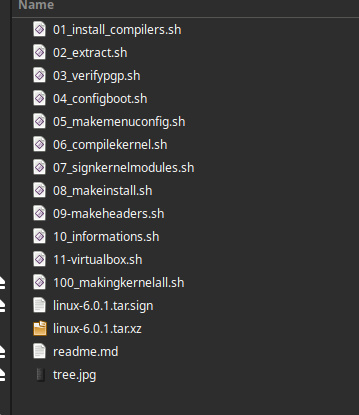

# LinuxKernelMaker
The one step to make compile, install and more.

Linux Kernel Maker
--------------------------------------------------------------------

Download, Compile and Install linux kernel by yourself the easy way.

--------------------------------------------------------------------

Version BETA . THIS IS A WORK IN PROGRESS . STILL PROBLEMS .

DOES NOT INSTALL RC VERSIONS

Absolutely NO pre-compiled software or kernel here.

Optimised for 6.X versions of kernels.

Step 1. Get the latest Linux kernel source code
https://www.kernel.org/

Step 2. Struggle a little bit (but it's easier to do)

Be sure ALL files in the same folder.

Files and what they do ?
--------------------------------------------------------------------

readme.md
	Used for ReadMe and version to compile.
	Write the kernel version you want to compile on the frst line.

OPEN EACH FILE BEFORE EXECUTING, SOME VAR NEED TO BE CHANGED.

-Step BY step compilation and install.

01_install_compilers.sh
	Install tools to mak kernel.

02_extract.sh
	Extract archive.

03_verifypgp.sh
	Non-mandatory operation.
	verify pgp.

04_configboot.sh
	Copy your boot options in config.

05_makemenuconfig.sh
	make menuconfig

06_compilekernel.sh
	Compile linux kernel

07_signkernelmodules.sh
	sudo make modules_install

08_makeinstall.sh
	Install kernel to system

09-makeheaders.sh
	Non-mandatory operation.
	Make headers for your drivers or extra.

10_informations.sh
	Check after reboot the running kernel

11-virtualbox.sh
	Must execute 10-makeheaders.sh before this.
	Execute sudo /sbin/vboxconfig for virtualbox.

-ALL in ONE compilation and install.

100_makingkernelall.sh
	Write kernel version on this file (See picture)
	ALL in one compile and install.
	Will do everything and check for errors.

	ALL AUTOMATIC is not activated by default.
	Because of it's implication on the host system.
	automatic=0 , change it on line 26 to automatic=1 FOR FULL AUTO.

	WORKING ON IT !!! FULL Automatic mode (NO input at all)

Create/check entry with grub-customizer and reboot.

Usefull link
-------------------------------------------------------------------

This web site help me alot THANKS !

	https://www.cyberciti.biz/tips/compiling-linux-kernel-26.html

Link to The Linux Kernel Archives
	https://kernel.org/

--------------------------------------------------------------------

            DO WHAT THE FUCK YOU WANT TO PUBLIC LICENSE
                        Version 3.1415926535
                          February 2022

	  As is customary and in compliance with current global and
	interplanetary regulations, the author of these pages disclaims
	all liability for the consequences of the advice given here,
	in particular in the event of partial or total destruction of
	the material, Loss of rights to the manufacturer warranty,
	electrocution, drowning, divorce, civil war, the effects of
	radiation due to atomic fission, unexpected tax recalls or
	    encounters with extraterrestrial beings elsewhere.

      LostByteSoft no copyright or copyleft we are in the center.

# --- End of file ---
